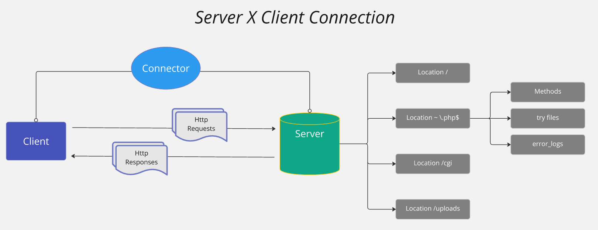

<br>

#### TESTING NGINX con las configuraciones a testear

```
make nginx
telnet localhost 8080
REQUES
````

#### Ejemplo de request:

```
GET index.html HTTP/1.1(Press Intro)
Host: www.basic_test.com(Press Intro)
(Press Intro)
```
```
- DEV: SO, compilador, glibc ... de telefonicar Para compilar.  
make dev
cd /src

#UNA VEZ EN EL CONTENEDOR SE DEBE HACER EL MAKE DEL PRYECT
make

- Para probarlo el programa, desde tu maquina (no contenedor)

telnet localhost 8008
REQUES

- Si quieres borrar docker de testeo o dev:
make nginx_clean
make dev_clean
````
<br>

## Proposed architecture

### Main Classes structure


### Server Client Connection

